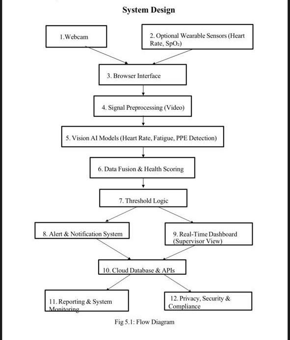

# ⛏️ AI-Enabled Health & Safety Monitoring System for Miners

A real-time computer vision system that monitors mining workers for fatigue, vital signs, and PPE compliance using a standard webcam — no wearable hardware required.

---

<div align="center">

## 🎬 Demo Video

[](https://www.youtube.com/watch?v=tqO06OmPuWw)

*Click above to see the system running live — fatigue detection, PPE compliance, and real-time vitals in action*

</div>

---

## Tech Stack

| Layer | Technology | Role |
|---|---|---|
| Backend Runtime | Python | Application server and processing core |
| Web Framework | Flask | REST API and page routing |
| Cross-Origin Support | Flask-CORS | Cross-origin request handling between frontend and backend |
| Video Capture | OpenCV (cv2) | Frame acquisition, optical flow, JPEG encoding, frame scaling |
| Face Analysis | MediaPipe Face Mesh | 468-landmark facial tracking for EAR, MAR, and forehead ROI |
| Object Detection | YOLOv8n (Ultralytics) | Real-time PPE item detection per frame |
| Array Processing | NumPy | EAR/MAR geometry, rPPG signal buffering, SpO₂ R-ratio computation |
| Signal Processing | SciPy FFT | Respiratory rate and heart rate extraction via frequency-domain analysis |
| Frontend UI | HTML5 / CSS3 / Vanilla JS | Browser-based dashboard with live metric cards and alert sidebar |
| Charting | Chart.js | Multi-axis real-time line chart for fatigue, HR, respiration, SpO₂ |
| Video Streaming | MJPEG over HTTP | Low-latency frame delivery via `multipart/x-mixed-replace` |
| Concurrency | Python threading | Non-blocking parallel execution for YOLO inference and capture loop |

---

## Features

**Fatigue Detection**
- Eye Aspect Ratio (EAR) computed from MediaPipe's 6-point eye landmarks, smoothed with exponential moving average (α = 0.60)
- Adaptive blink detector using a rolling 80th-percentile open-eye baseline — self-calibrates per individual without manual tuning
- Microsleep detection flags consecutive eye closures ≥ 18 frames (~0.6s at 30fps)
- PERCLOS computed over a 60-second rolling window — frames where EAR falls below threshold divided by total frames
- Yawn detection via Mouth Aspect Ratio (MAR) with slope validation and a 0.8s sustain requirement to eliminate transient mouth movements

**Remote Vital Sign Estimation**
- Heart rate via rPPG: extracts the green channel mean from a forehead ROI across a 15-second buffer, applies FFT peak detection in the 40–180 BPM range
- SpO₂ estimated from the red-to-green AC/DC ratio (R-ratio) mapped to oxygen saturation using the 110 − 25R formula
- Respiration rate via dense optical flow (Farneback method) on a chest ROI, FFT peak extracted in the 6–30 BPM band over a 30-second buffer

**PPE Compliance Monitoring**
- YOLOv8n runs asynchronously in a background thread at ~10 inferences/second on 320×240 downscaled frames
- Hysteresis thresholding: item goes ON at ≥ 40% detection ratio, turns OFF only at ≤ 25% — prevents state flickering
- Person presence is driven by MediaPipe face detection for instant response; YOLO handles equipment items independently
- Alerts raised per missing item (helmet, goggles, vest, gloves, boots) whenever a person is confirmed present

**Alert System**
- Per-alert deduplication with a 5-second cooldown to prevent flooding
- Thresholds: PERCLOS ≥ 0.35, fatigue score ≥ 75, SpO₂ < 94%, HR < 45 or > 120 BPM, respiration < 8 or > 25 BPM
- Timestamped alert history (last 100 events) polled every 2 seconds by the frontend

---
## System Design



---

## Getting Started

### Prerequisites

- Python 3.9+
- Webcam (USB or built-in)
- Good ambient lighting for accurate rPPG readings

### Installation

```bash
git clone https://github.com/Partha-Shankar/Ai-enabled-Health-and-Safety-Monitoring-System-for-Miners.git
cd Ai-enabled-Health-and-Safety-Monitoring-System-for-Miners
pip install flask flask-cors opencv-python mediapipe scipy numpy ultralytics
```

### Run

```bash
python app.py
```

Navigate to `http://localhost:5003`

---

## How It Works

1. Open the home page — three default miners are pre-loaded (John Smith, Sarah Johnson, Michael Brown)
2. Click **+ Add New Miner** to register a worker with name, ID, shift, and gender
3. Click **🎥 Start Monitoring** on any miner card to open their dedicated dashboard
4. Press **▶ Start** to activate the webcam — the live feed and metrics begin immediately
5. Vital signs (HR, SpO₂, respiration) populate after ~10–15 seconds of stable face data
6. Alerts appear in the left sidebar as they trigger; the chart tracks fatigue score, HR, respiration, and SpO₂ in real time
7. Press **🔄 Reset** to clear all session counters between shifts

---

## Fatigue Score Calculation

The composite fatigue score (0–100) is a weighted combination of three signals:

```
fatigue_raw = (0.45 × eye_score) + (0.30 × yawn_score) + (0.25 × resp_score)

eye_score   = 0.7 × PERCLOS + 0.3 × (1 − e^(−0.5 × microsleep_count))
yawn_score  = min(yawn_count / 5, 1.0)
resp_score  = deviation from 12–20 BPM normal range, clipped to [0, 1]
```

The raw score is smoothed with an EMA (α = 0.12) to produce stable output without lagging too far behind real state changes.

---

## Project Summary

Fatigue and PPE non-compliance are two of the leading causes of injury in mining environments. Most existing solutions depend on wearable hardware — which is expensive, requires maintenance, and often goes unused by workers. This system brings the same level of monitoring to any workstation with a webcam, running entirely in-browser with no additional infrastructure.

The architecture is intentionally single-file and dependency-light so it can be deployed quickly on existing mine site hardware. The adaptive baselines, hysteresis thresholds, and signal deduplication are all designed with real-world noise in mind — the kind of flickering lights, partial occlusions, and shift-fatigue variability that breaks systems tuned only on clean lab data.
